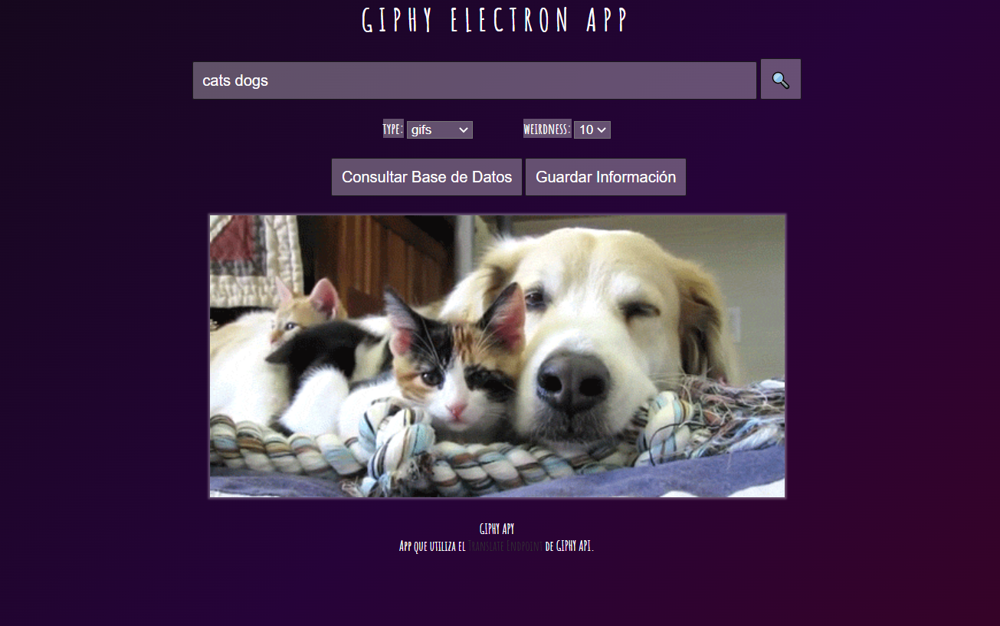

# GIPHY MySQL App
- App que utiliza el [Translate Endpoint](https://developers.giphy.com/docs/api/endpoint/#translate) de GIPHY.
- Da la opcion al usuario de guardar el resultado en una base de datos de MySQL.

